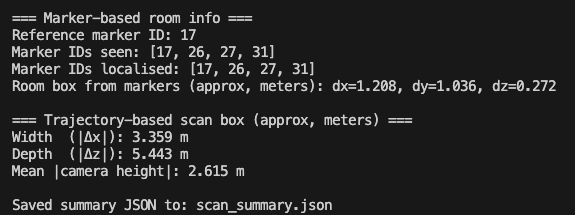

## Overview

---

How to use the ArUco detection markers

## Prerequisites

---

- Python 3.8 or higher
- Ensure all libraries are installed
- Charuco board for calibration
- at least 3 single arucos
    - both of these can be generated via the ***generate_boards.py*** script
    - default number of single arucos is 5 but it can be modified before running to produce more
    - arucos are selected randomly from the dictionary
- measure charuco **solid squares** to be ~30mm (or slightly less)
- measure arucos to be ~96 mm
- device has a camera built in or linked to a mobile phone camera (idk how to do this tbh my laptop is configured like that automatically)

## Step-by-Step Instructions

---

### Step 1: generate boards

- run ***generate_boards.py***  to produce:
    - 1 charuco board
    - ≥ 3 single aruco markers
- generate_boards.py automatically generates 5 single arucos but this can be changed in the script where the generate_aruco(count) is called in main
- verify:
    - charuco board solid square is ~30mm (or slightly less, cannot be more)
    - single arucos are ~96 mm

### Step 2: calibrate camera

- calibration is only required once per camera
- take 20-30 images of the charuco board on a solid surface
- vary the angle of the images slightly
    - occlusions and partial views are allowed
- place all images in the ***calib_images*** folder
    - make sure images are one of the allowed types:
        - .jpg, .jpeg, .png
- run ***calibrate_charuco.py***
    - this will produce a ***calibration_charuco.npz*** file in the same directory
    - this file contains all the camera intrinsics FOR YOUR SPECIFIC CAMERA. if you use a new camera, you will need a new npz file

### Step 3: set up markers

- take at least 3 single arucos and set them up in the space
    - initial marker on the main wall
    - second marker on adjacent wall
    - third marker on floor
    - (optional) fourth and fifth markers on another wall

### Step 4: run live room scan

- run ***live_room_scan.py***
    - make sure your camera calibration file is in the same directory as this script
    - camera will open up with an interface that displaces each marker’s normals, what markers are in view, and how many frames are captured
- make sure the main marker is the first marker the camera sees
    - this is the reference point for the world. this marker must be in view for frames to be captured
- move camera slowly so that main marker and one other marker are in frame
    - repeat this process until all markers are shown
    - more than two markers can be in the frame at once but the main one must be visible at all times
- press q once enough information is gathered
    - output will be saved to ***scan_summary.json***

**example console output:**



**example scan_summary.json:**

```json
{
  "markers_world": {
    "7":  { "position": [x, y, z], "normal": [nx, ny, nz], "up": [ux, uy, uz] },
    "12": { ... },
    "23": { ... }
  },
  "planes": {
    "floor": {
      "point": [x, y, z],
      "normal": [nx, ny, nz]
    },
    "wall_A": {
      "point": [x, y, z],
      "normal": [nx, ny, nz]
    },
    "wall_B": { ... }
  },
  "approx_room_box_m": {
    "width_x": ...,
    "depth_z": ...,
    "height_y": ...
  },
  "camera_trajectory": {
    "num_poses": N,
    "path_file": "camera_trajectory.npy"
  }
}
```

## Tips & Best Practices

---

*Offer bonus advice to improve the experience or avoid common errors.*

- move camera slowly to avoid motion blur
- set up the wall markers at about the same height
- place markers near edges or important parts of the room

## **Troubleshooting**

---

*Highlight common issues and provide guidance on how to resolve them.*

- note that camera trajectory is NOT the room’s dimensions, its how much the camera has moved. this being a rather high number (over 5 m) is normal


## How to Run the Simulation Space:

1. cd into folder **src/prototypes/pipline/simulation_space**
2. In the terminal, run the command: **python -m http.server**
3. Then in the browser, navigate to [**http://localhost:8000/**](http://localhost:8000/) (check that the port # is correct)

## How to Use the Simulation Space:

1. On the menu on the right-hand side, click ‘Upload Scan JSON’
2. Select a valid JSON scan (contains the correct information) and upload
3. The model will generate automatically (as long as the provided JSON contains the correct information and format)